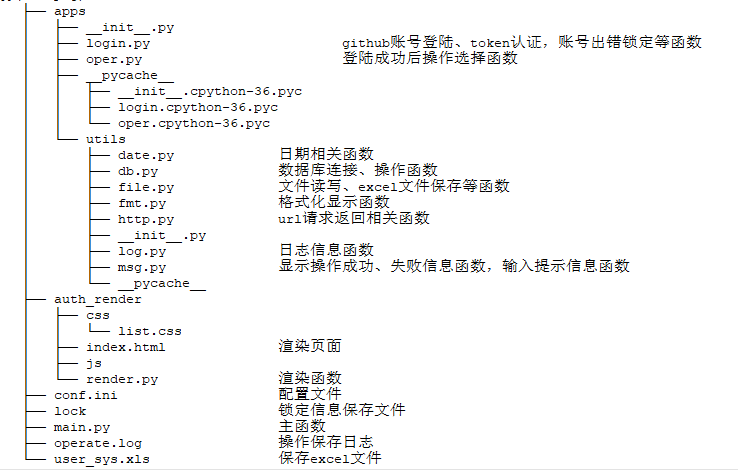

### github账号的token：
 - 218f44a13dd981c96ef3dcbedc6fa576a067039c
### 功能：
    对用户信息列表进行增、删、改、查、保存至excel文件、退出操作
    将用户数据渲染到网页
    操作账号出错锁定
 - 增：追加新用户
 - 删：对指定的用户ID记录进行删除
 - 改：对指定的用户ID记录进行修改
 - 查：根据ID查找指定用户、查找所有用户
 - 存：将用户信息保存至数据库中或excel文件
 - 渲染：将用户数据返回到网页
 - 锁：用户输入错误超三次将按设定的时长进行锁定，保存到锁定文件lock中
### 建库建表
    CREATE DATABASE user_sys;
    CREATE TABLE auth_user(
        id int PRIMARY KEY AUTO_INCREMENT,
        username varchar(30),
        age int(3),
        tel varchar(30),
        address varchar(50),
        create_time datetime(6),
        update_time datetime(6)
    );

### 文件结构说明：

    ├── apps
    │   ├── __init__.py
    │   ├── login.py						github账号登陆、token认证，账号出错锁定等函数
    │   ├── oper.py							登陆成功后操作选择函数
    │   ├── __pycache__
    │   │   ├── __init__.cpython-36.pyc
    │   │   ├── login.cpython-36.pyc
    │   │   └── oper.cpython-36.pyc
    │   └── utils
    │       ├── date.py				日期相关函数
    │       ├── db.py				数据库连接、操作函数
    │       ├── file.py				文件读写、excel文件保存等函数
    │       ├── fmt.py				格式化显示函数
    │       ├── http.py				url请求返回相关函数
    │       ├── __init__.py
    │       ├── log.py				日志信息函数
    │       ├── msg.py				显示操作成功、失败信息函数，输入提示信息函数
    │       └── __pycache__
    ├── auth_render
    │   ├── css
    │   │   └── list.css
    │   ├── index.html				渲染页面
    │   ├── js
    │   └── render.py				渲染函数
    ├── conf.ini					配置文件
    ├── lock						锁定信息保存文件
    ├── main.py						主函数
    ├── operate.log					操作保存日志
    └── user_sys.xls				保存excel文件